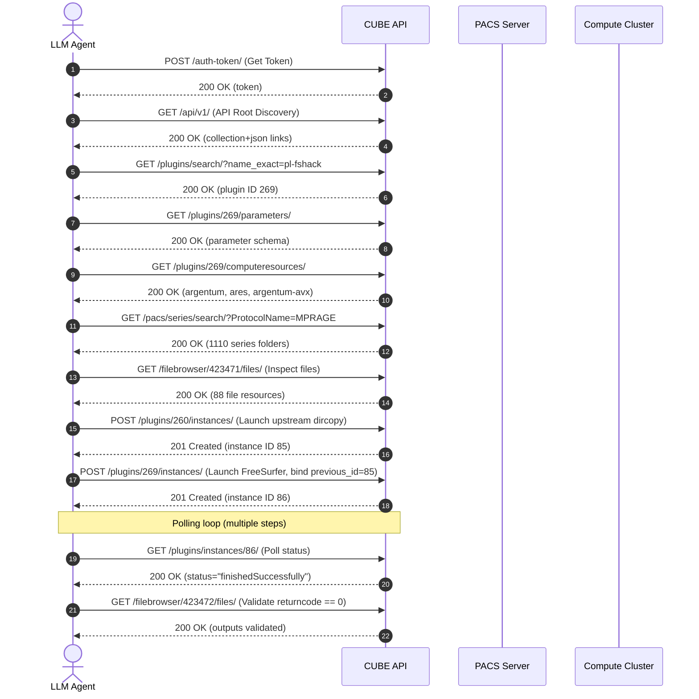
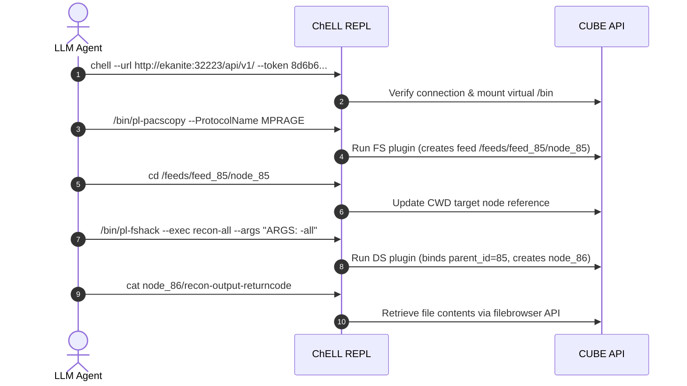
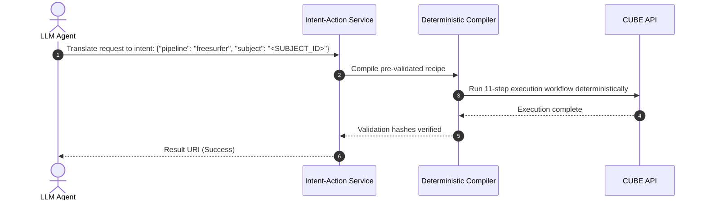

# Cumulative Failure Projections: CUBE API vs. Chell vs. IAS

This document compiles the scientific narrative and comparative failure model for autonomous agent execution of neuroimaging pipelines (e.g., FreeSurfer volumetrics) on ChRIS.

---

## 1. Paradigm Walkthroughs

### Paradigm A: Raw CUBE API Choreography
The agent interacts directly with ChRIS CUBE via raw HTTP/REST requests. Every link discovery, parameter schema read, folder navigation, and state polling is a separate step requiring LLM token generation, parameter parsing, and decision-making.



*   **Total Steps ($N$):** $11$ (assuming minimal status polling).
*   **Branching Choices ($b$):** High ($b \approx 2.5$). The agent must make selections among 1110 PACS matches, choose the correct compute resource name, parse custom argument strings (`exec="recon-all"`, `args="ARGS: -all"`), and correctly interpret status and silent error codes.
*   **Accumulated Risk:** High. The probability of error compounds at each API call boundary.

---

### Paradigm B: Scripted Choreography (ChELL REPL)
The agent operates via `ChELL` (ChRIS Interactive Shell), which maps ChRIS collections and feeds onto a virtual filesystem and mounts plugins as executable binaries under a virtual `/bin` directory.



*   **Total Steps ($N$):** $5$.
*   **Branching Choices ($b$):** Medium ($b \approx 1.5$). While link discovery is collapsed into filesystem directories, the agent must still correctly navigate paths, configure plugin arguments manually (e.g. `--exec recon-all --args`), and inspect output logs (`cat`).
*   **Accumulated Risk:** Medium.

---

### Paradigm C: Intent-Action Service (IAS) Lookup
The agent is decoupled from the execution runtime. It maps the user's plain-language request to a single structured intent object. The IAS compiles this intent against a deterministic, pre-validated pipeline recipe and runs it.



*   **Total Steps ($N$):** $1$.
*   **Branching Choices ($b$):** Negligible ($b \approx 1.0$). Translation is completed in a single pass. The execution is entirely deterministic and run by standard code.
*   **Accumulated Risk:** Zero execution-time drift.

---

## 2. Mathematical Error Propagation Model

We model success probability $P_{\text{success}}$ by separating two distinct error sources:
1.  **Intent Translation Error ($p_t$):** The probability that the agent fails to map the user request to the correct intent template or extracts the wrong parameters (e.g., wrong Subject ID). This applies to all paradigms at the start.
2.  **Execution Choreography Error ($p_e$):** The probability that the agent fails at a step during the execution flow (e.g. syntax, link navigation, or logic errors). This compounds with the number of execution steps $N$.

The overall success probability is:

$$P_{\text{success}} = (1 - p_t) (1 - p_e)^N$$

If we assume execution steps are correlated with a cascade coefficient $c$ (where $c = 0$ represents independent events and $c \to 1$ represents cascading failures):

$$P_{\text{success}}(c) = (1 - p_t) \prod_{i=1}^{N} \left[1 - p_e(1 - c)^{i-1}\right]$$

In the **IAS paradigm**, the execution is handled entirely by a deterministic compiler ($N = 0$ execution steps from the agent's perspective). Thus, its success rate is bounded only by the translation error:

$$P_{\text{success, IAS}} = (1 - p_t)$$

Below is a comparison of success probabilities across the three paradigms for varying error rates. We assume a baseline translation error of $p_t = 3\%$ across all models, and compare success for different per-step execution error rates ($p_e$):

| Per-Step Execution Error ($p_e$) | Paradigm A: Raw API ($N=11$) | Paradigm B: Chell ($N=4$) | Paradigm C: IAS ($N=0$) |
| :--- | :--- | :--- | :--- |
| **$1\%$ (Near-perfect)** | $86.8\%$ | $93.2\%$ | **$97.0\%$** |
| **$2\%$ (Highly reliable)** | $77.7\%$ | $89.5\%$ | **$97.0\%$** |
| **$5\%$ (Typical LLM)** | $55.2\%$ | $79.0\%$ | **$97.0\%$** |
| **$10\%$ (Unconstrained)** | $30.4\%$ | $63.7\%$ | **$97.0\%$** |

> [!IMPORTANT]
> The IAS does have a translation error threshold ($p_t \approx 3\%$), meaning it is not 100% error-free. However, because it eliminates the compounding execution steps ($N=0$), it acts as a **circuit breaker** against the exponential failure curve that dominates multi-step direct API execution.

---

## 3. Narrative Architecture for Poster

To explain this clearly on the poster, we present three vertical columns that map to these findings:

```
+--------------------------+--------------------------+--------------------------+
|      LEFT COLUMN         |      CENTRAL COLUMN      |      RIGHT COLUMN        |
|  (Raw API & Distress)    |   (Takeaway & QR Code)   |    (IAS & Relief)        |
+--------------------------+--------------------------+--------------------------+
|  Introduction            |  AI WILL ALWAYS LIE      |  Results                 |
|  * Searle's Chinese Room |  IF PUT IN CHARGE OF     |  * Mathematical Model    |
|  * Cumulative probability|  NEUROIMAGING PIPELINES  |  * Silence success risk  |
|                          |                          |                          |
|  Methods (Raw CUBE API)  |  +--------------------+  |  The IAS Solution        |
|  * 11 steps of HTTP calls|  |                    |  |  * Generative Translator |
|  * Branching factor b=2.5|  |   [QR CODE HERE]   |  |  * Deterministic Compiler|
|                          |  |                    |  |  * Safe N=1 execution    |
|  [PANEL 1 CARTOON]       |  +--------------------+  |                          |
|  (Traversing deep graph  |  Scan for code & logs    |  [PANEL 2 CARTOON]       |
|   scientists in panic)   |                          |  (Selecting flat list    |
|                          |                          |   scientists relieved)   |
+--------------------------+--------------------------+--------------------------+
```
