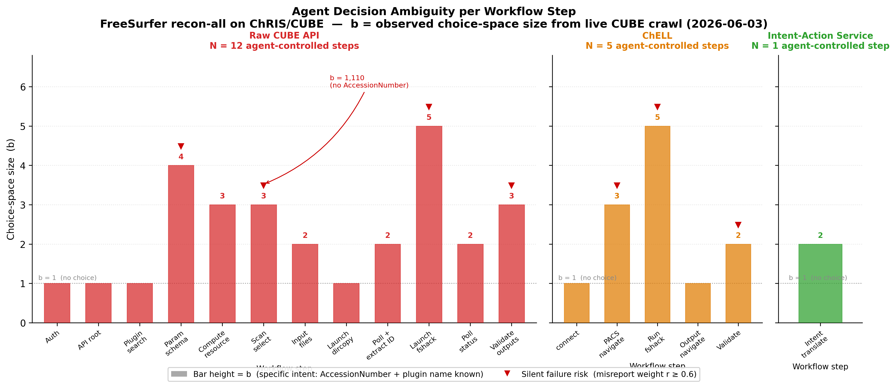
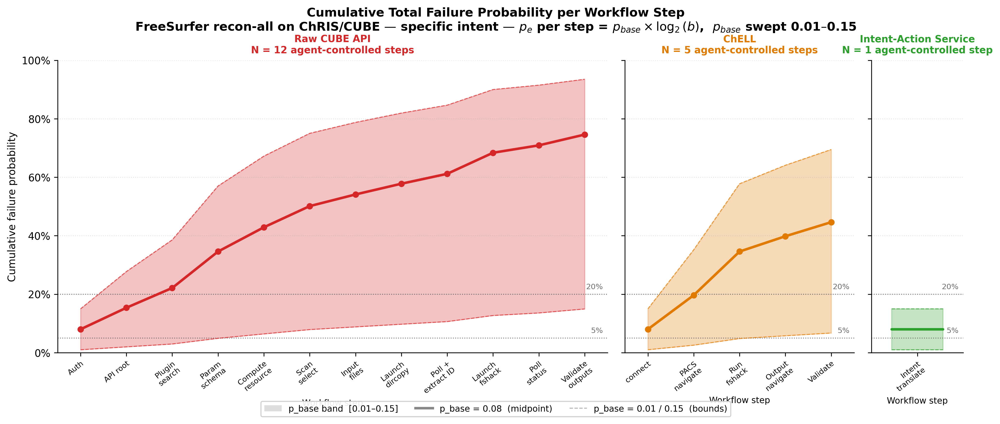
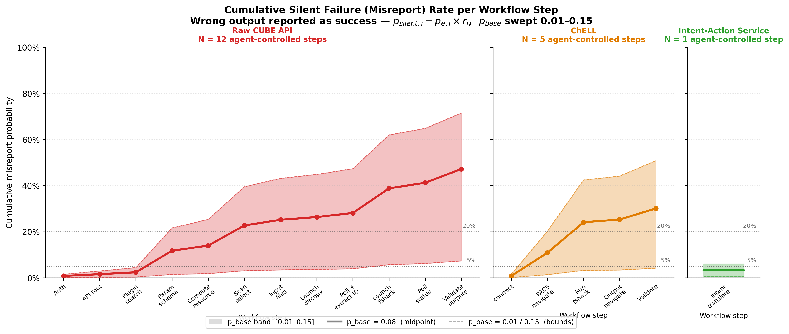

:stem: latexmath

== Experimental Evaluation

The theoretical argument predicts three things that can be measured on a real system: that the action space an agent must traverse is large and unevenly branched, that failure probability compounds with path length, and that a substantial fraction of that failure is silent. This section reports a discovery trial against a production ChRIS deployment, quantifies the decision space it exposed, and models the resulting failure behaviour across three orchestration paradigms.

=== Testbed

ChRIS is an open-source platform for containerised medical image analysis, in clinical and research use at Boston Children's Hospital and elsewhere. Its backend, CUBE, exposes a Collection+JSON hypermedia API over feeds, plugins, plugin instances, PACS series and a file browser. It is a fair testbed for the question at hand: the tool graph is real, the workflows are clinically meaningful, and the API is neither adversarially obscure nor unusually convenient.

The task chosen was deliberately routine: run FreeSurfer volumetrics, `recon-all`, on a T1-weighted MPRAGE series. This is the sort of request an agentic assistant is now routinely claimed to handle from a natural-language prompt.

Three orchestration paradigms were compared over the same deployment.

**Raw CUBE API choreography.** The agent is given the API entry point and constructs the workflow itself: discover links, identify the plugin, read its parameter schema, choose a compute resource, locate an input series, bind the upstream feed, launch, poll, and validate outputs.

**ChELL, a shell-style abstraction.** ChRIS collections and feeds are mapped onto a virtual filesystem and plugins are mounted as executables under a virtual `/bin`. This collapses link discovery into path navigation but leaves plugin choice, argument construction and output inspection with the agent.

**Intent-Action Service.** The agent's only available action is to emit a structured intent. The IAS compiles that intent against a prevalidated recipe and executes it deterministically.

=== Discovery trial: can an agent infer the choreography?

An unbounded LLM agent was given the CUBE entry point and the task intent, with read-only access, and asked to discover the resource space and infer the correct sequence. The trial ran between 2026-06-01 and 2026-06-03 against a live deployment.

The agent did eventually construct a plausible choreography, and that is the least interesting part of the result. What matters is what it could not resolve.

**Domain knowledge was not recoverable from the API.** The FreeSurfer plugin is named `pl-fshack`. Searches for the plausible names `freesurfer`, `free` and `surfer` returned zero results. The plugin became discoverable only once a human supplied the exact string. An agent equipped with the entire API and no domain knowledge cannot find the tool it needs, and receives no signal that it has failed to find it; a zero-result search is indistinguishable from a capability that does not exist.

**Input selection was left underdetermined at scale.** The intent specifies a T1 or MPRAGE input. The corresponding query, `ProtocolName=MPRAGE`, returned **1,110 candidate series**. Nothing in the intent, and nothing in the API, selects among them. Supplying a specific subject or accession number collapses this to a branching factor of 3. The difference between an underspecified and a specified intent at this single step is therefore a factor of roughly 370 in the size of the choice the agent must make correctly, and choosing wrongly produces a complete, successful-looking analysis of the wrong patient.

**At least ten read and discovery calls were required before any launch**, and the trial identified **at least nine agent-controlled decision points from discovery alone**, before counting launch, monitoring and output validation.

**A silent-failure affordance was discovered and correctly left alone.** The `pl-fshack` parameter schema exposes six parameters, one of which, `no_fail`, causes the plugin to report success when FreeSurfer exits non-zero. The agent noted the default of `false` and did not change it. That is the correct behaviour, but it is a choice the agent was free to make, and an agent that set it would produce a run that reports success, writes outputs, and is wrong.

=== The decision space is real and unevenly branched

<<<fig-ambiguity>>> plots the observed choice-space size stem:[b] at each agent-controlled step for the three paradigms, with the specific-intent baseline used for the raw-API scan-selection step. Steps at which an error is likely to be silent rather than loud are marked.

[#fig-ambiguity]
.Choice-space size stem:[b] per agent-controlled step across the three paradigms, from the live CUBE crawl. Markers indicate steps with high misreport risk (stem:[r_i \geq 0.6]). The scan-selection step is annotated with stem:[b = 1{,}110] for the underspecified case against stem:[b = 3] when an accession number is supplied.

Two features are worth drawing out. First, branching is not uniform: most steps are effectively forced (stem:[b = 1]) while a small number carry nearly all of the ambiguity, notably parameter-schema interpretation (stem:[b = 4]), scan selection, and plugin launch with its custom argument strings (stem:[b = 5]). Risk is concentrated, not spread. Second, the high-branching steps coincide with the high-misreport steps. The places where the agent has the most freedom are also the places where being wrong is least visible.

The paradigms differ in the number of agent-controlled steps: **12 for raw API, 5 for ChELL, and 1 for IAS**. ChELL removes syntax and link-discovery burden but does not remove the decisions that matter; the residual steps it retains are precisely the high-branching ones.

=== Compounding failure

Following the model of Section 6, per-step error probability is taken to scale with the logarithm of the local branching factor,

[stem]
++++
p_{e,i} = \min\!\big(0.95,\; p_{base} \cdot \log_2 b_i\big),
++++

with a base error rate stem:[p_{base}] swept over stem:[[0.01, 0.15]] and a midpoint of stem:[0.08]. This brackets plausible per-decision reliability for current models on structured tasks without committing to a single figure.

[#fig-total]
.Cumulative probability of at least one failure, by step, for the three paradigms. Bands span stem:[p_{base} \in [0.01, 0.15]]; the solid line is stem:[p_{base} = 0.08].

<<<fig-total>>> shows the consequence. Under raw API choreography, cumulative failure probability rises steeply and monotonically with path length; under ChELL it rises more slowly; under IAS the curve is a single point, because the agent takes one action.

A closed-form comparison makes the magnitude concrete. Assuming a common intent-translation error stem:[p_t = 3\%] and independent per-step execution error stem:[p_e] over the stem:[N = 12] and stem:[N = 5] agent-controlled steps of <<<fig-total>>>, with output validation counted as an agent step in both cases:

[cols="1,1,1,1",options="header"]
|===
| Per-step execution error stem:[p_e] | Raw API | ChELL | IAS
| 1% (near-perfect) | 86.0% | 92.2% | **97.0%**
| 2% (highly reliable) | 76.1% | 87.7% | **97.0%**
| 5% (typical) | 52.4% | 75.1% | **97.0%**
| 10% (unconstrained) | 27.4% | 57.3% | **97.0%**
|===

The IAS column is constant because the agent performs no execution steps. Its residual error is entirely intent-translation error, and it does not compound. This is the practical content of the collapsing-map argument: IAS does not make the agent more reliable, it removes the exponent.

=== Silence is the dominant failure mode

Total failure probability understates the problem. A workflow that fails loudly is a nuisance; a workflow that fails silently and reports success is a clinical hazard. Each step is therefore assigned a misreport weight stem:[r_i], the probability that an error at that step is silent rather than raised, giving

[stem]
++++
p_{silent,i} = p_{e,i} \cdot r_i .
++++

[#fig-silent]
.Cumulative silent-failure (misreport) probability by step. Same paradigms, bands and midpoint as <<<fig-total>>>.

The steps carrying the highest misreport weight are exactly those identified in the trial: scan selection (stem:[r = 0.8]), plugin launch with custom arguments (stem:[r = 0.8]), and output validation (stem:[r = 0.8]). All three produce a completed run with plausible artifacts when they go wrong. Selecting the wrong series from 1,110 candidates yields a complete FreeSurfer analysis of the wrong patient, with a zero return code and a full output directory. No error is raised because, procedurally, nothing failed.

This is the sense in which the agent "lies". It does not emit a false statement. It executes a valid procedure on the wrong object and reports, accurately, that the procedure succeeded.

=== What has not yet been measured

The results above characterise the decision space and model its consequences. They do not yet demonstrate run-to-run variance, which is the reproducibility claim and requires repeated trials of the same intent under identical conditions.

The protocol for that experiment is specified: two to three fixed clinical intents with validated gold DAGs, stem:[N = 50] to stem:[100] trials per intent per condition, fixed datasets to remove data-induced variance, identical timeouts and plugin caps, full logging of call sequences, constructed DAGs, timing and seeds, and a four-way outcome classification separating syntactic failure, structural failure, and the critical category of runs that complete but are clinically invalid. The execution harness exists. This experiment is outstanding and is the natural next step.

Its prediction is direct: repeated identical intents under raw API and ChELL should produce workflows that differ structurally between runs, while under IAS they should be bit-identical, with residual variance confined to the rendering of the intent itself.
